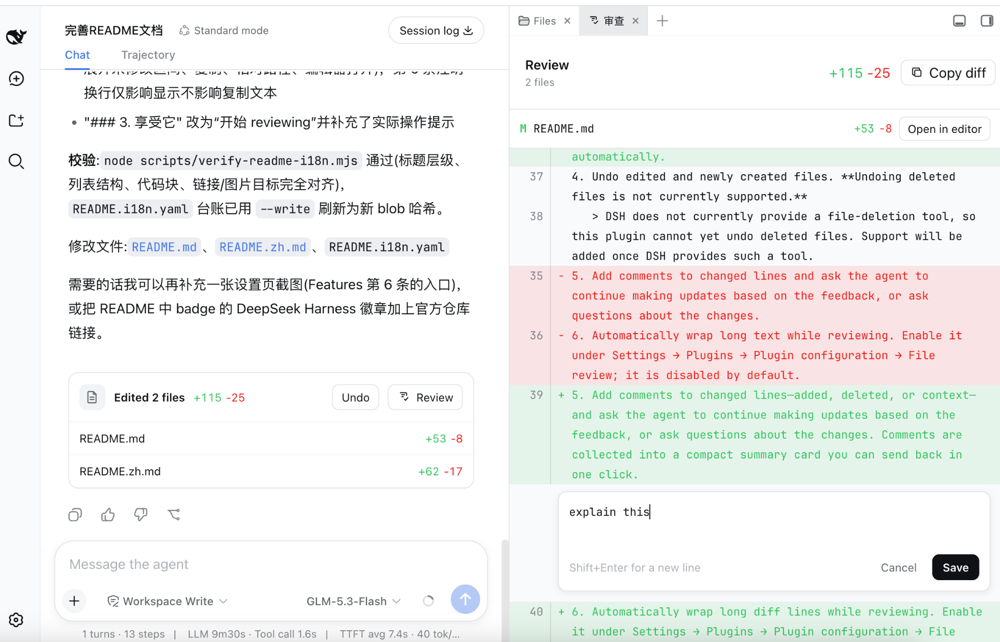

<div align="center">

# DSH File Review

**Review every file an agent just changed—without leaving DeepSeek Harness Web.**


[](https://www.npmjs.com/package/dsh-file-review)
[](https://www.npmjs.com/package/dsh-file-review)
[](https://github.com/new-Beginner/dsh-diff-review-likecodex)
[](LICENSE)

English · [简体中文](README.zh.md)

</div>

## How to use

<p align="center">
  <strong>💬 Chat &nbsp;→&nbsp; ✨ Generate &nbsp;→&nbsp; 📄 Click a changed file &nbsp;→&nbsp; 🔍 Review</strong>
</p>

## Preview

Standalone usage:


Used with dsh-better-sidebar:


## Features

1. Supports [DSH Better Sidebar](https://github.com/omdsh-dev/DSH-better-sidebar). You can use this plugin on its own or together with DSH Better Sidebar.
2. This plugin supports standard, PTC, and Creator modes, but **does not currently support Minimal mode**.
3. Review every file the agent just changed in the `Diff` panel.
4. Undo edited and newly created files. **Undoing deleted files is not currently supported.**
   > DSH does not currently provide a file-deletion tool, so this plugin cannot yet undo deleted files. Support will be added once DSH provides such a tool.
5. Add comments to changed lines and ask the agent to continue making updates based on the feedback, or ask questions about the changes.
6. Automatically wrap long text while reviewing. Enable it under Settings → Plugins → Plugin configuration → File review; it is disabled by default.
7. Multilingual support, including Chinese and English.

## Compatibility

The currently adapted versions are shown in the compatibility badges above. Other versions have not been verified.

## Quick start

### 0. Add dsh-file-review and dsh-better-sidebar to pnpm's minimum release age allowlist

Open `~/.dsh/profiles/web/pnpm-workspace.yaml` and add:

```yaml
minimumReleaseAgeExclude:
  - dsh-file-review
  - dsh-better-sidebar
```

Recent versions of `pnpm` enforce a minimum release age, so newly published packages are not installed until that waiting period has passed. To install the latest versions, add both `dsh-file-review` and `dsh-better-sidebar` to the exclusion list.

### Install dsh-better-sidebar (optional)

> Skip this step if you do not need dsh-better-sidebar or already have it installed. This plugin works without dsh-better-sidebar.
> For details, see the [DSH Better Sidebar installation instructions](https://github.com/omdsh-dev/DSH-better-sidebar#installation).

```sh
dsh plugin --profile web add dsh-better-sidebar@latest   # 首次会因 pnpm 11 拦截 node-pty 构建脚本而失败（依赖已写入）
cd ~/.dsh/profiles/web && pnpm approve-builds --all      # 放行构建脚本（自动重跑安装）
dsh plugin --profile web add dsh-better-sidebar@latest   # 重跑即成功
```

### 1. Install this plugin

```sh
dsh plugin --profile web add dsh-file-review
```

### 2. Start DSH Web

```sh
dsh web
```

### 3. Enjoy it

## Install from source

```sh
git clone https://github.com/new-Beginner/dsh-diff-review-likecodex.git
cd dsh-file-review
pnpm install
pnpm run build
dsh plugin --profile web add ${PWD}
```

## Install from GitHub repository

```sh
dsh plugin --profile web add github:new-Beginner/dsh-diff-review-likecodex
```

## Update the plugin

```sh
dsh plugin --profile web update dsh-file-review
```

## Uninstall the plugin

```sh
dsh plugin --profile web remove dsh-file-review
```

## Roadmap

- [ ] Add undo support for deleted files.

## Friendly Links

[LINUX DO](https://linux.do/) — A new ideal community

## License

[MIT](LICENSE)
