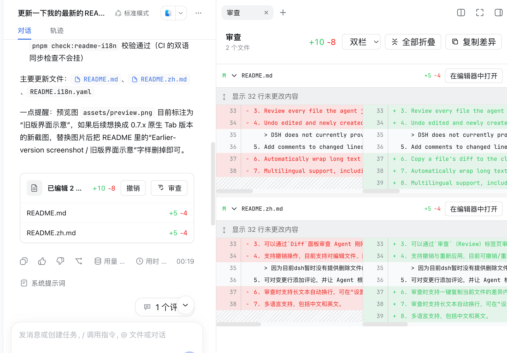

<div align="center">

# DSH Diff Review Likecodex

**Review every file an agent just changed—without leaving DeepSeek Harness Web.**

[](package.json)

[](LICENSE)

English · [简体中文](README.zh.md)

</div>

## Repository and namespace

`dsh-diff-review-likecodex` is an independent plugin hosted at [new-Beginner/dsh-diff-review-likecodex](https://github.com/new-Beginner/dsh-diff-review-likecodex).

The plugin owns the `diffReviewLikecodex` remote/service namespace, `diff-review-likecodex` settings/locale namespace, `dshDiffReviewLikecodex` marker property, and `diff-review-likecodex.deliverables` turn data key. Its UI/plugin registration IDs use the `dsh-diff-review-likecodex:` prefix. Public DSH slots retain their framework names; this plugin does not register the shared `chatFileMentions` service, avoiding conflicts with other plugins.

Historical compatibility markers are read-only compatibility data, used only when no plugin marker is present. The Host neither consumes legacy markers as its own nor deletes or rewrites them. New comments use `<diff_review_likecodex_comments>`; historical `<file_review_comments>` messages remain displayable without writing legacy services or settings. The Cordis patch only inserts this plugin and does not disable DSH's built-in deliverables plugin.

## How to use

<p align="center">
  <strong>💬 Chat &nbsp;→&nbsp; ✨ Generate &nbsp;→&nbsp; 📄 Click a changed file &nbsp;→&nbsp; 🔍 Review</strong>
</p>

## Preview



## Features

1. This plugin supports standard, PTC, and Creator modes, but **does not currently support Minimal mode**.
2. Review every file the agent just changed in the `Diff` panel.
3. Undo edited and newly created files. Deleted-file reversal requires a tool that supplies a supported, captured lifecycle change.
4. Add comments to changed lines and ask the agent to continue making updates based on the feedback, or ask questions about the changes.
5. Automatically wrap long text while reviewing. Enable it under Settings → Plugins → Plugin configuration → Diff Review Likecodex; it is disabled by default.
6. Multilingual support, including Chinese and English.
7. A compact, content-sized review bar appears above the composer while a turn is running and disappears on completion or stop; the final card always shows all files.
8. Absolute/relative aliases for the same workspace file are combined without double-counting; same-named files in different directories show their directory for disambiguation.
9. Newly captured diffs retain three real context lines before and after changes; missing historical context is never fabricated from current files.
10. Open the review page from the right sidebar and use its turn picker to load every recorded file edit from one conversation turn. With `dsh-better-sidebar@0.19.1` installed, the review page is also available in its new-tab menu; otherwise the native right-sidebar tab remains available. Native tab layout itself is not guaranteed to persist across restarts.

## Compatibility

See the badge above for the currently supported DSH CLI version. `dsh-better-sidebar` is an optional peer dependency (`>=0.19.1 <0.20`), not a required browser injection; the native sidebar remains the fallback.

## Install from local source

Run these commands in your existing checkout of this fork. No clone URL is provided because the fork's repository is not yet known. Installation and deployment are separate actions; reviewing or building this source does not install it.

```sh
pnpm install
pnpm run build
dsh plugin --profile web add ${PWD}
```

## Package installation after publication

Only after you have independently confirmed publication of this exact fork package, use:

```sh
dsh plugin --profile web add dsh-diff-review-likecodex
```

Recent `pnpm` versions may enforce a minimum release age. If needed, add the fork's exact package name to `minimumReleaseAgeExclude` in `~/.dsh/profiles/web/pnpm-workspace.yaml`:

```yaml
minimumReleaseAgeExclude:
  - dsh-diff-review-likecodex
```

## Update the plugin

For a package-based installation, after confirming the target release:

```sh
dsh plugin --profile web update dsh-diff-review-likecodex
```

## Uninstall the plugin

```sh
dsh plugin --profile web remove dsh-diff-review-likecodex
```

## Friendly Links

[LINUX DO](https://linux.do/) — A new ideal community

## License

[MIT](LICENSE). This fork retains the upstream MIT license and copyright notice in `LICENSE`; the file must not be deleted. Upstream attribution remains separate from this fork's package identity.
